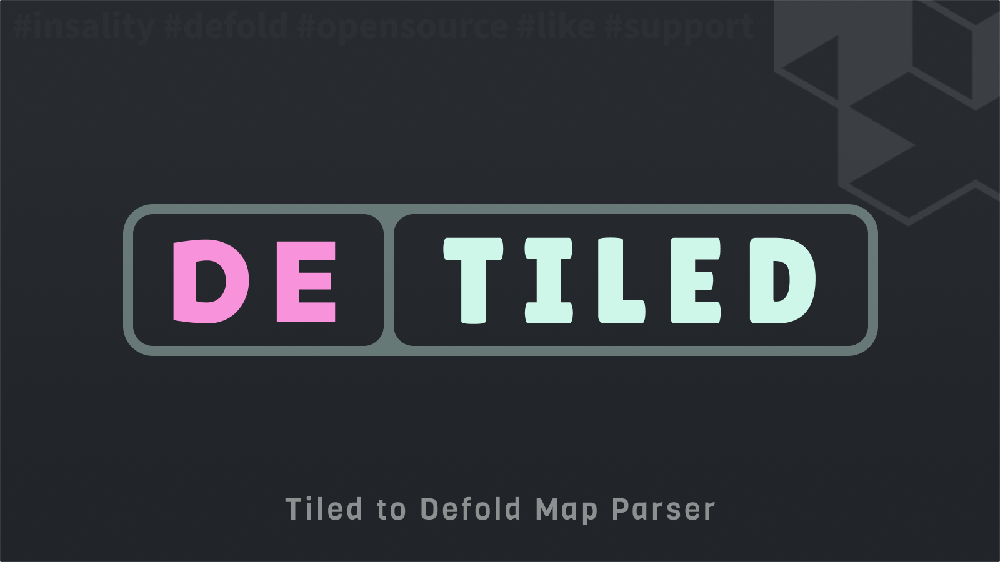

[](https://github.com/Insality/detiled/tags)
[](https://github.com/Insality/detiled/actions)
[](https://codecov.io/gh/Insality/detiled)

[](https://github.com/sponsors/insality) [](https://ko-fi.com/insality) [](https://www.buymeacoffee.com/insality)


# Detiled

**Detiled** is a Defold library that converts [Tiled](https://www.mapeditor.org/) maps and tilesets into easy-to-use entities. It supports all Tiled grid types: orthogonal, hexagonal, and isometric.

## Features

- Load tilesets and parse maps to get map entities
- Use prefab IDs to spawn game entities
- Adjust entity properties from tilesets and maps
- Convert cell indices to world position and vice versa


### Setup

Open your `game.project` file and add the following line to the dependencies field under the project section:

**[Detiled](https://github.com/Insality/detiled/archive/refs/tags/3.zip)**

```
https://github.com/Insality/detiled/archive/refs/tags/3.zip
```

After that, select `Project ▸ Fetch Libraries` to update [library dependencies](https://defold.com/manuals/libraries/#setting-up-library-dependencies). This happens automatically whenever you open a project, so you only need to do this if dependencies change without re-opening the project.

### Library Size

> **Note:** The library size is calculated based on the build report per platform

| Platform         | Library Size |
| ---------------- | ------------ |
| HTML5            | **12.91 KB**  |
| Desktop / Mobile | **20.55 KB**  |


## Setup


### Tiled

Tiled is a map editor for creating 2D games. It is used to create maps and tilesets for your game.
Detiled supports tilesets and exports maps as Lua table entities for Defold, which can be used to spawn game entities.


#### Creating Tilesets

Detiled supports collection-of-images tilesets, because each tile should have an associated prefab. Single-image tilesets are not supported.

Create a new tileset and add images to it. Usually, you will have a `/tiled` folder with all Tiled files for the project. Place the tileset inside `/tiled/tilesets` and add this folder as a custom resource in `game.project`.

```init
[project]
custom_resources = /tiled/tilesets
```

Each tile in a tileset has a `prefab_id`, which will be available in your Defold project. By default, `prefab_id` is the image name without extension. For example, `player.png` becomes `player`. You can change `prefab_id` in the tileset editor by setting the tile `class`. This way, one image can have multiple `prefab_id` values.


#### Creating Maps

Create a new map and save it in `/tiled/maps` with the `.json` extension. Since Detiled loads JSON files, this keeps the workflow simple.

To load JSON files, add this folder as a custom resource in `game.project`.

```init
[project]
custom_resources = /tiled/tilesets,/tiled/maps
```

Now you can create tile and object layers and place entities directly on the map.
You can also add shapes (rectangle, point, polygon, polyline, ellipse) directly on the map. Since these entities have no tileset tile associated with them, they have no `prefab_id` by default. You can assign a `prefab_id` by setting a `class` on the map object.

Each tile from a tileset will be exported as a single entity.


#### Custom Properties

Tiled has good support for custom properties. Open `View -> Custom Types Editor` and add custom classes with the properties you need.
You can add and override custom properties on tiles in tilesets or directly on object instances in maps. In `Custom Types Editor`, use defaults only as editor-time templates, because this default data is not exported to Defold.


### Defold

When tilesets and maps are ready, you can spawn entities.

Detiled library provides a simple API to parse maps and tilesets.

```lua
detiled.load_tileset(tileset_path_or_data) -- required before parsing a map
detiled.parse(map_path_or_data) -- returns layers, map_params
```


#### Loading Tilesets

First, load the tileset used by your maps.

```lua
local detiled = require("detiled.detiled")
detiled.load_tileset("/tiled/tilesets/my_tileset.json")
```

#### Parsing Maps

Then parse a map to get a layers table and `map_params` as the second return value.

```lua
local layers, map_params = detiled.parse("/tiled/maps/my_map.json")
```

`layers` is a table with layer id as key and layer data as value. Layer data contains an `entities` list and layer properties. Iterate over it to create game objects.


```lua
---@param entity detiled.entity
---@param layer_data detiled.layer_data
local function spawn_entity(entity, layer_data)
	local prefab_id = entity.prefab_id
	local transform = entity.transform

	local position = vmath.vector3(
		transform.position_x + layer_data.position_x,
		transform.position_y + layer_data.position_y,
		transform.position_z + layer_data.position_z
	)
	local scale = vmath.vector3(transform.scale_x, transform.scale_y, 1)
	local rotation = vmath.quat_rotation_z(math.rad(transform.rotation or 0))

	local factory_url = "/entities#" .. prefab_id
	factory.create(factory_url, position, rotation, nil, scale)
end


---@param layers detiled.layers
local function spawn_map(layers)
	for layer_name, layer_data in pairs(layers) do
		local entities = layer_data.entities
		local layer_position_x = layer_data.position_x -- Horizontal offset from layer settings
		local layer_position_y = layer_data.position_y -- Vertical offset from layer settings
		local layer_position_z = layer_data.position_z -- From position_z custom property on layer settings
		local is_visible = layer_data.visible

		for _, entity in ipairs(entities) do
			spawn_entity(entity, layer_data)
		end
	end
end
```

If you add custom properties to an entity in a tileset or map, they are available on the parsed entity.

```lua
local function spawn_entity(entity, layer_data)
	local prefab_id = entity.prefab_id
	local my_component = entity.my_component
	if my_component then
		print(my_component.value)
	end

	-- rest of the code
end
```

### Layer Properties

Layers support special properties:
- `exclude` *(boolean)* - This layer is skipped and not parsed
- `position_z` *(number)* - Base Z for entities spawned from this layer

Entities support specific properties:
- `position_z` - A position_z for the entity transform
- `width` and `height` - Width and height of the entity, available only when `prefab_id` is missing


### Cell to Position and Position to Cell

Detiled provides a simple API to convert cell indices to world position and vice versa.

```lua
local layers, map_params = detiled.parse("/tiled/maps/my_map.json")
detiled.cell_to_pos(i, j, map_params) -- returns x, y
detiled.pos_to_cell(x, y, map_params) -- returns i, j
```


### Adjusting Entity Position

You can set an `anchor` position for an entity in the tileset. This is useful when your Defold game object anchor differs from the sprite center. For example, a tree game object is usually placed on the ground. To adjust its placement, open the tileset, select the tree tile, and open `Tile Collision Editor`. Then add a `Point` object at the desired sprite anchor position. This point is used to calculate the final entity position in Defold.


## Game Example

Look at [Shooting Circles](https://github.com/Insality/shooting_circles) or [Cosmic Dash](https://github.com/Insality/cosmic-dash-jam-2025) game examples to see how to use the Detiled library in a real game project.


## API Reference

### Quick API Reference

```lua
detiled.set_logger(logger_instance)
detiled.load_tileset(tileset_path_or_data) -- required before parsing a map
detiled.parse(map_path_or_data) -- returns layers, map_params
detiled.cell_to_pos(i, j, map_params) -- returns x, y
detiled.pos_to_cell(x, y, map_params) -- returns i, j
```

### API Reference

Read the [API Reference](api/detiled_api.md) file to see the full API documentation for the module.

## License

This project is licensed under the MIT License - see the [LICENSE](LICENSE) file for details.

## Issues and Suggestions

For any issues, questions, or suggestions, please [create an issue](https://github.com/Insality/detiled/issues).

## 👏 Contributors

<a href="https://github.com/Insality/detiled/graphs/contributors">
  
</a>


## Changelog

<details>

### **V1**
	- Initial release

### **V2**
	- Reworked API and documentation

### **V3**
	- Unbind from Decore library
	- Rename `detiled.get_entity_from_map` to `detiled.parse`
	- Add `detiled.cell_to_pos` and `detiled.pos_to_cell` API
	- Rework map parse return params, now it's a layers table with entities and properties with map_params as second return value
	- Add all grid types support, not only orthogonal. All hexagonal and isometric grids are supported.

</details>

## ❤️ Support project ❤️

Your donation helps me stay engaged in creating valuable projects for **Defold**. If you appreciate what I'm doing, please consider supporting me!

[](https://github.com/sponsors/insality) [](https://ko-fi.com/insality) [](https://www.buymeacoffee.com/insality)

