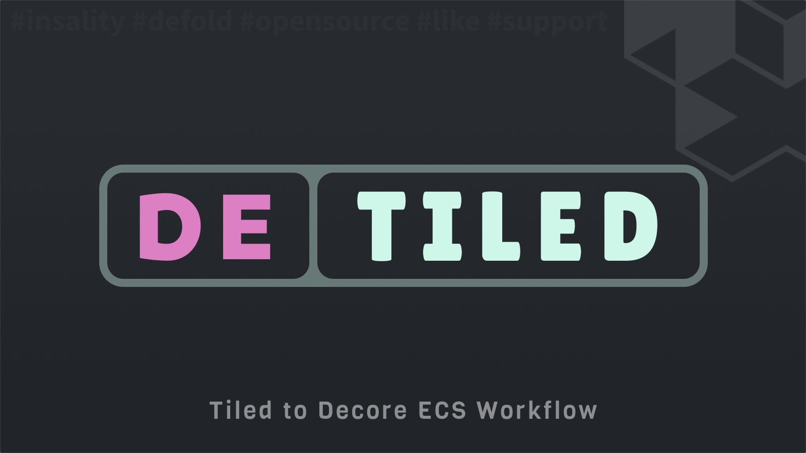

[](https://github.com/Insality/detiled/tags)
[](https://github.com/Insality/detiled/actions)
[](https://codecov.io/gh/Insality/detiled)

[](https://github.com/sponsors/insality) [](https://ko-fi.com/insality) [](https://www.buymeacoffee.com/insality)


# Disclaimer

The library in development stage. May be not fully tested and README may be not full. If you have any questions, please, create an issue.

# Detiled

**Detiled** - is a Defold library that converts [Tiled](https://www.mapeditor.org/) maps and tilesets into [Decore](https://github.com/Insality/decore) entities.

## Features

- Load tilesets with prefab definitions and component properties
- Convert Tiled maps to Decore entities
- Use class names as prefab IDs, with fallback to image names
- Support for custom properties and components from Tiled


### [Dependency](https://www.defold.com/manuals/libraries/)

Open your `game.project` file and add the following line to the dependencies field under the project section:

**[Decore](https://github.com/Insality/decore)**

```
https://github.com/Insality/decore/archive/refs/tags/1.zip
```

**[Detiled](https://github.com/Insality/detiled/archive/refs/tags/1.zip)**

```
https://github.com/Insality/detiled/archive/refs/tags/1.zip
```

After that, select `Project ▸ Fetch Libraries` to update [library dependencies]((https://defold.com/manuals/libraries/#setting-up-library-dependencies)). This happens automatically whenever you open a project so you will only need to do this if the dependencies change without re-opening the project.

### Library Size

> **Note:** The library size is calculated based on the build report per platform

| Platform         | Library Size |
| ---------------- | ------------ |
| HTML5            | **1.96 KB**  |
| Desktop / Mobile | **3.35 KB**  |


## Setup

### Workflow

1. Load all tilesets before loading maps:
   ```lua
   local detiled = require("detiled.detiled")

   -- Load tilesets first
   detiled.load_tileset("/resources/tilesets/my_tileset.json")
   ```

2. Convert Tiled maps to Decore entities:
   ```lua
   -- Get entity from map
   local map_entity = detiled.get_entity_from_map("/resources/maps/my_map.json")

   -- Add to Decore world
   world:addEntity(map_entity)
   ```

### Prefab ID Resolution

Prefab IDs are determined in this order:
1. `class` field from the tile or object in Tiled
2. `type` field as fallback
3. Image filename (without path/extension) as final fallback

### Object Types

- **Tile Objects** - Objects with `gid` (from tileset) use tileset properties
- **Class Objects** - Objects with `class` field spawn as that prefab type
- **Empty Objects** - Objects without `gid` or `class` spawn as basic entities

### Custom Properties

Custom properties from Tiled become Decore components:
- Properties with `propertytype` matching the property name become components
- Regular properties become component values
- Nested object properties are merged into existing components


## Game Example

Look at [Shooting Circles](https://github.com/Insality/shooting_circles) game example to see how to use the Detiled library in a real game project.


## API Reference

### Quick API Reference

```lua
detiled.set_logger(logger_instance)
detiled.load_tileset(tileset_path_or_data)
detiled.get_entity_from_map(map_path_or_data)
```

### API Reference

Read the [API Reference](API_REFERENCE.md) file to see the full API documentation for the module.


## Use Cases

Read the [Use Cases](USE_CASES.md) file to see several examples of how to use the this module in your Defold game development projects.

## License

This project is licensed under the MIT License - see the [LICENSE](LICENSE) file for details.

## Issues and Suggestions

For any issues, questions, or suggestions, please [create an issue](https://github.com/Insality/detiled/issues).

## 👏 Contributors

<a href="https://github.com/Insality/detiled/graphs/contributors">
  
</a>

## ❤️ Support project ❤️

Your donation helps me stay engaged in creating valuable projects for **Defold**. If you appreciate what I'm doing, please consider supporting me!

[](https://github.com/sponsors/insality) [](https://ko-fi.com/insality) [](https://www.buymeacoffee.com/insality)

